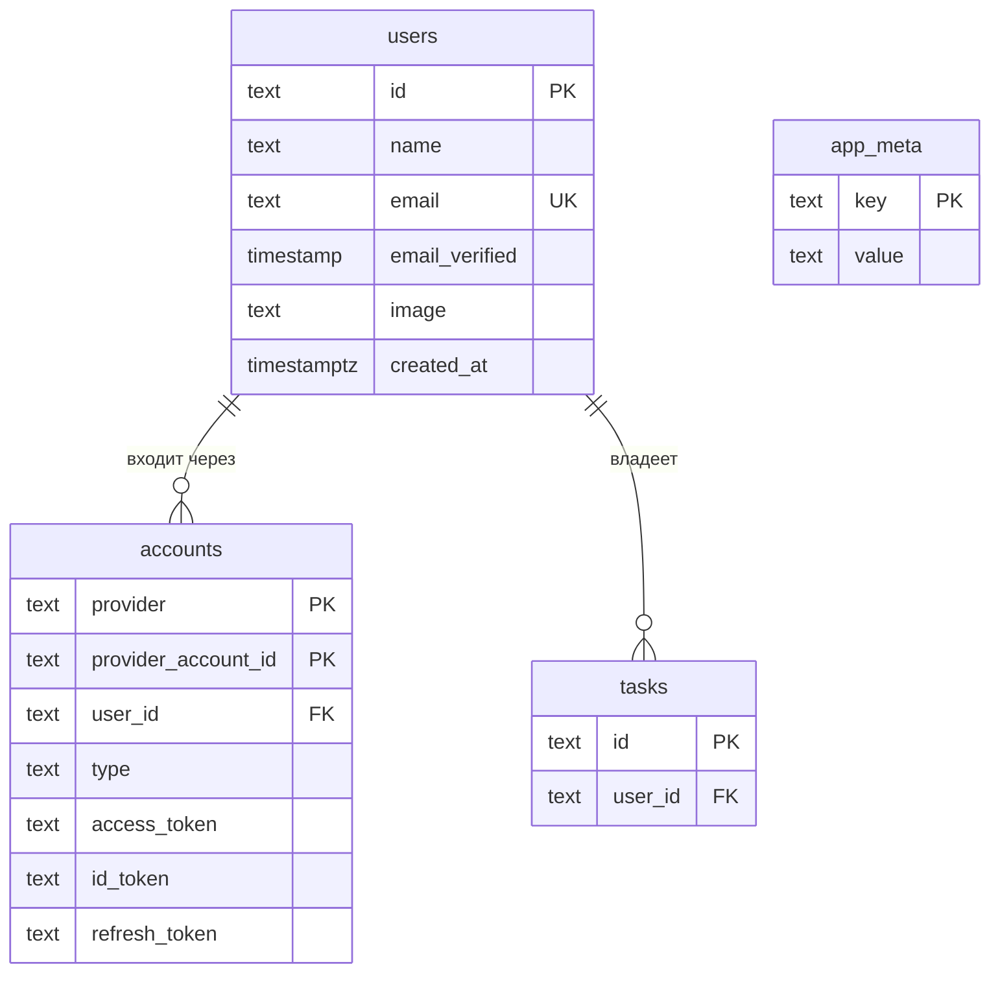

# Сущности базы

Что лежит в Postgres и что это значит. Один файл — одна таблица.

**Колонки и типы задаёт код:** `apps/api/src/db/schema.ts` и миграции в
`apps/api/drizzle/`. Здесь — смысл: зачем сущность, кто её пишет и читает, что в ней
обязано оставаться истинным. Разошлись документ и схема — верна схема, документ правится
в том же PR, что и миграция.

Решения о сущности и их обоснования живут в спеке задачи (`CLAUDE.md` §4, фаза 3), сюда
ведёт ссылка.

## Карта

## Список

| Сущность                 | Таблица    | Состояние                     | Задача |
| ------------------------ | ---------- | ----------------------------- | ------ |
| [Пользователь](user.md)  | `users`    | запланирована, #52 фаза 1     | #52    |
| [Аккаунт](account.md)    | `accounts` | запланирована, #52 фаза 1     | #52    |
| [Служебное](app-meta.md) | `app_meta` | в схеме                       | #51    |
| Задача                   | `tasks`    | запланирована, документа нет  | #46    |

«Запланирована» — таблицы в `schema.ts` ещё нет; документ описывает решение из спеки и
сверяется со схемой в PR, который таблицу добавляет.

## Формат документа сущности

`Что это` → `Колонки` → `Ключи и ограничения` → `Связи` → `Кто пишет, кто читает` →
`Инварианты` → `Жизненный цикл` → `Чего здесь нет`.

Диаграммы — Mermaid: он рендерится прямо на GitHub. Карта связей — `erDiagram` в этом
файле; жизненный цикл сущности со статусами — `stateDiagram-v2` в её документе, один
автомат на диаграмму.
