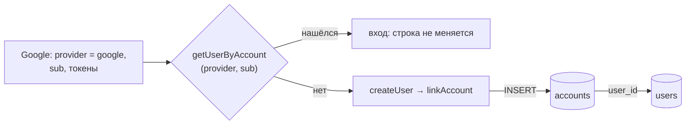

# Аккаунт — `accounts`

Состояние: **запланирована**, появляется в #52, фаза 1. Спека:
`docs/specs/52-google-auth.md`.

## Схема

Читается и пишется только при входе. Код приложения к таблице не обращается.

## Что это

Связь [пользователя](user.md) с его учётной записью у внешнего провайдера входа.
Провайдер один — Google, поэтому у пользователя одна строка. По этой таблице Auth.js при
входе отвечает на вопрос «этот аккаунт Google уже наш пользователь?».

## Колонки

| Колонка               | Тип       | Пусто | Смысл                                              |
| --------------------- | --------- | ----- | -------------------------------------------------- |
| `user_id`             | `text`    | нет   | чей аккаунт — `users.id`                           |
| `type`                | `text`    | нет   | вид провайдера; у Google — `oidc`                  |
| `provider`            | `text`    | нет   | идентификатор провайдера: `google`                 |
| `provider_account_id` | `text`    | нет   | идентификатор пользователя у Google (`sub`)        |
| `access_token`        | `text`    | да    | токен доступа Google, живёт около часа             |
| `id_token`            | `text`    | да    | подписанный Google токен с профилем                |
| `refresh_token`       | `text`    | да    | токен обновления; Google выдаёт его не всегда      |
| `expires_at`          | `integer` | да    | когда истекает `access_token`, секунды Unix        |
| `token_type`          | `text`    | да    | тип токена: `bearer`                               |
| `scope`               | `text`    | да    | выданные права: `openid email profile`             |
| `session_state`       | `text`    | да    | поле протокола OIDC, Google его не присылает       |

Набор колонок целиком задаёт контракт адаптера Auth.js (`@auth/drizzle-adapter`,
`src/lib/pg.ts`).

## Ключи и ограничения

- Первичный ключ — составной: `(provider, provider_account_id)`.
- `user_id → users.id`, `ON DELETE CASCADE`.

## Связи

- Многие к одному с [пользователем](user.md). На практике — один к одному, пока
  провайдер один.

## Кто пишет, кто читает

- **Пишет** адаптер Auth.js: `linkAccount` при первом входе.
- **Читает** адаптер: `getUserByAccount` при каждом входе.
- Код приложения к таблице не обращается; токены из неё никуда не уходят.

## Инварианты

- `ONE_USER_PER_GOOGLE_ACCOUNT`: первичный ключ не даёт привязать один аккаунт Google
  дважды.
- Аккаунта без пользователя не бывает (`NOT NULL` + внешний ключ). Обратное возможно:
  пользователь без аккаунта остаётся, если первый вход оборвался между `createUser` и
  `linkAccount` (спека, риск 4).

## Жизненный цикл

Статусов нет. Строка создаётся при первом входе; при повторных входах не обновляется —
токены в ней остаются от первого входа.

## Чего здесь нет

- Сессий: сессия — JWT в cookie, в базе её нет.
- Обращений к API Google: токены лежат, но приложение ими не пользуется. Хранить ли их
  вообще — открытый вопрос спеки (риск 2).
