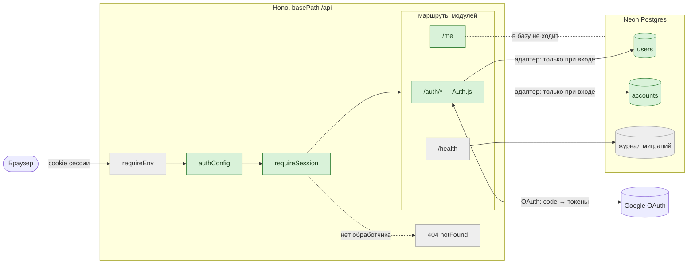
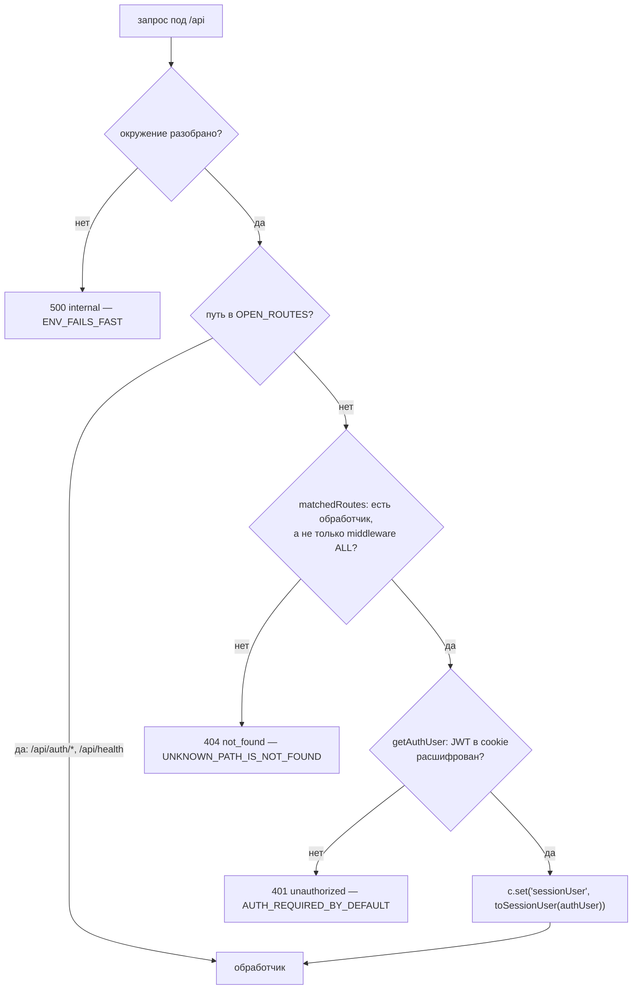
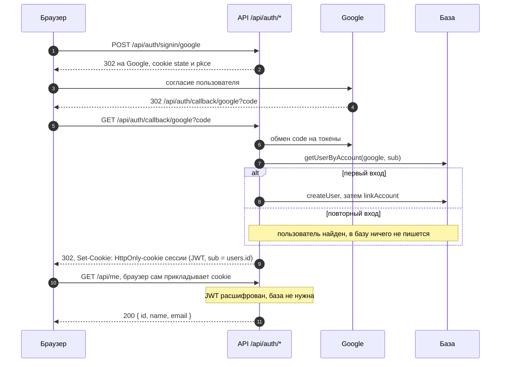
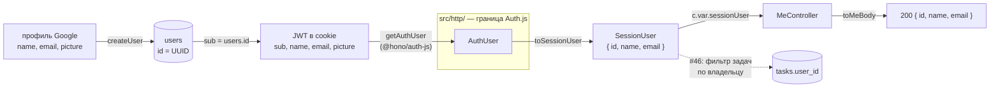
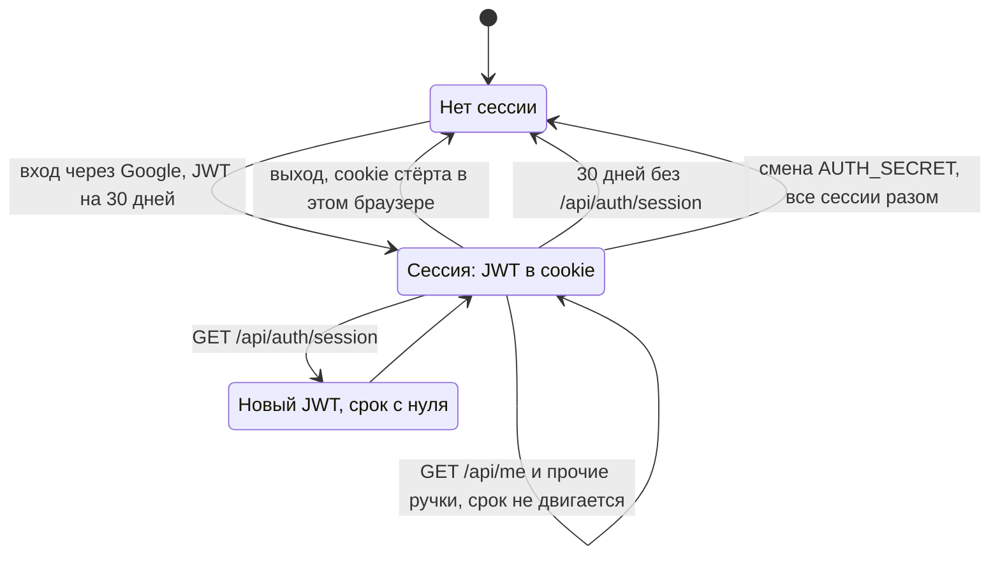
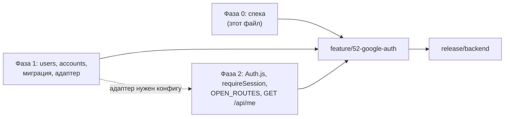

# #52 — Вход через Google на беке

## Схемы

Сначала картинки, потом текст: всё ниже в спеке — обоснование того, что нарисовано здесь.
Зелёным — то, что появляется в этой задаче; серым — то, что уже есть.

### 1. Где это живёт

Один origin (#50): локально браузер ходит в API через прокси Vite, на проде — в функцию
Netlify. Google и база — внешние.



### 2. Что меняется в сборке приложения

`apps/api/src/create-app.ts` — порядок вызовов. Остальная раскладка файлов — в
«Раскладка» ниже.

```diff
 createApp(deps)
   app.use('*', requireEnv)                 # окружение → c.var.env
+  app.use('*', authConfig(deps))           # конфиг Auth.js из env + адаптер из deps
+  app.use('*', requireSession)             # OPEN_ROUTES / 404 / 401 / c.var.sessionUser
+  registerAuthRoutes(app)                  # /api/auth/* → authHandler()
   registerHealthRoutes(app, deps)
+  registerMeRoutes(app)                    # GET /api/me
   app.notFound(respondNotFound)            # 404 {"error":"not_found"}
   app.onError(respondInternalError)        # 500 {"error":"internal"}
```

### 3. Как `requireSession` решает судьбу запроса



Итог — таблица ответов. Это и есть контракт задачи; критерии приёмки ниже — её строки.

| Запрос                    | Без сессии          | С сессией               |
| ------------------------- | ------------------- | ----------------------- |
| `GET /api/health`         | как до задачи       | как до задачи           |
| `GET /api/auth/signin`    | страница Auth.js    | страница Auth.js        |
| `GET /api/me`             | `401 unauthorized`  | `200 {id, name, email}` |
| `POST /api/me`            | `404 not_found`     | `404 not_found`         |
| `GET /api/nope`           | `404 not_found`     | `404 not_found`         |
| новая ручка без правки `OPEN_ROUTES` | `401`    | обработчик              |
| любой, окружение неполное | `500 internal`      | `500 internal`          |

### 4. Вход через Google



### 5. Откуда модуль знает, кто вошёл

Поток данных о пользователе. Типы Auth.js заканчиваются на HTTP-краю
(`AUTH_TYPES_STAY_AT_EDGE`): дальше `requireSession` идёт только наш `SessionUser`.



### 6. Жизнь сессии

Один JWT на 30 дней, без refresh-токена. Срок сдвигает только новый токен.



Отзыва одной сессии на сервере нет — см. риск 1.

### 7. Фазы и ветки



## Задача

Дать API вход через Google и сессию в cookie так, чтобы любая зарегистрированная ручка,
кроме явно открытых, без сессии отвечала `401`.

## Прототип

Своего экрана входа в этой задаче нет — прототип не делается (человек, 2026-10-04).

Что человек видит до #46: встроенную страницу Auth.js по адресу `/api/auth/signin` —
карточка с одной кнопкой «Sign in with Google» (`@auth/core`,
`lib/pages/signin.tsx:96-143`), без нашего оформления и на английском. Нажатие ведёт на
страницу согласия Google и обратно. Приложение на фронте о входе ещё не знает и работает
как раньше, с `localStorage`.

Свой экран входа, кнопка выхода и гейт перед приложением — #46: там это фаза 0 с
прототипом (светлая и тёмная тема, узкий экран) и выбором направления.

## Решения

### Приняты человеком

- **Полноценный вход, единственный провайдер — Google** (2026-09-23). Общий секретный
  токен отклонён.
- **Auth.js через `@hono/auth-js`, адаптер Drizzle, `strategy: 'jwt'`** (2026-09-23 —
  2026-09-24). Better Auth и `@hono/oauth-providers` отклонены.
- **Пакеты** (2026-10-04, `CLAUDE.md` §10): `@hono/auth-js` 1.1.1, `@auth/core` 0.41.3,
  `@auth/drizzle-adapter` 1.11.3.
- **Путь, которого нет, отвечает `404` — есть сессия или нет** (2026-10-04, ревью спеки;
  заменяет ответ того же дня «`401` на всё, что не открыто»). Поведение как до задачи
  (`apps/api/src/create-app.ts:24`). `401` получает только запрос без сессии к
  существующей закрытой ручке.
- **Экран входа — встроенная страница Auth.js, свой экран — в #46** (2026-10-04).
- **Новый JWT выпускает `/api/auth/session`; каждый вход даёт новый токен**
  (2026-10-04). Поведение библиотеки как есть, см. «Срок сессии» ниже.
- **Клиент Google OAuth создаёт человек** (2026-10-04); секреты — в окружении Netlify и
  в локальном `apps/api/.env`.
- **Вход на деплой-превью не работает** (2026-09-24): Google не принимает шаблоны
  адресов возврата. Превью и так выключены (`netlify.toml:27-31`).

### Что выяснено в фазе 0

Источники — исходники пакетов, ветка `main` на 2026-10-04: `@hono/auth-js`
(`honojs/middleware`, `packages/auth-js/src/index.ts`), `@auth/core`
(`nextauthjs/next-auth`, `packages/core/src/…`), `@auth/drizzle-adapter`
(`packages/adapter-drizzle/src/lib/pg.ts`).

- **Таблицы адаптера: пять, заводим две.** Обязательны `usersTable` и `accountsTable`,
  остальные три опциональны (`pg.ts:584-586`).

  Заводим:

  - `users` — **кто пользователь**: одна строка на человека. Её `id` уходит в `sub`
    сессии и станет владельцем задач (#46).
  - `accounts` — **каким внешним аккаунтом человек входит**: пара «провайдер +
    идентификатор у провайдера» → `users.id`. По ней вход отвечает на вопрос «этот
    аккаунт Google уже наш пользователь?».

  Не заводим:

  - `sessions` — сессии при `strategy: 'database'`: строка на каждую активную сессию, в
    cookie только её ключ. У нас сессия — JWT в cookie.
  - `verificationTokens` — одноразовые токены входа по ссылке из письма (Magic Link).
    Входа по почте нет.
  - `authenticators` — ключи WebAuthn (passkey) пользователя. WebAuthn нет.

  Почему `users` и `accounts` — две таблицы, а не одна: человек и способ входа разведены,
  чтобы к одному человеку можно было привязать несколько провайдеров. Провайдер у нас
  один, строк будет по одной, но контракт адаптера требует обе. Подробно —
  `docs/entities/user.md`, `docs/entities/account.md`.
- **Адаптер не открывает транзакций** (в `pg.ts` нет вызова `transaction`), поэтому ему
  хватает драйвера `neon-http` — того же, что уже едет в функцию
  (`apps/api/tests/function-bundle.test.ts:31`).
- **Проверка сессии не ходит в базу.** При `strategy: 'jwt'` действие `session` только
  расшифровывает cookie (`lib/actions/session.ts:42-45`); к адаптеру обращается лишь
  ветка `database` (`:96-98`).
- **Идентификатор пользователя — `sub` токена.** При входе в токен кладутся `name`,
  `email`, `picture` и `sub: user.id` (`lib/actions/callback/index.ts:143-146`), где
  `user` — строка, созданная адаптером.
- **Окружение библиотека читает сама**, через `env(c)` из `hono/adapter`: `AUTH_SECRET`,
  `AUTH_URL` (`index.ts:75,130`). Мимо `ENV_SCHEMA` эти переменные не идут — они в неё
  добавляются (см. «Окружение»).
- **`AUTH_URL` задаёт и адрес, и путь.** Хост, протокол и порт запроса заменяются
  взятыми из `AUTH_URL` (`index.ts:40-49`); путь становится `basePath`
  (`lib/utils/env.ts:15-24`); заданная `AUTH_URL` включает `trustHost`
  (`env.ts:44-49`). Без `AUTH_URL` адрес собирался бы из заголовков
  `x-forwarded-proto` / `x-forwarded-host` (`index.ts:51-70`) — что в них кладёт
  Netlify, не проверялось, и с обязательной `AUTH_URL` проверять не нужно.
- **`Secure` у cookie зависит от протокола.** `useSecureCookies` по умолчанию —
  `url.protocol === 'https:'` (`lib/init.ts:109`); от него же зависит префикс
  `__Secure-` (`lib/utils/cookie.ts:60-69`). `HttpOnly` и `SameSite=Lax` стоят всегда.
- **Срок сессии.** Отдельных access- и refresh-токенов нет: в cookie лежит один JWT со
  сроком жизни 30 дней (`lib/init.ts:71`). Токен не продлевается — выпускается новый:
  - каждый вход через Google выпускает новый JWT
    (`lib/actions/callback/index.ts:143-150`);
  - запрос к `/api/auth/session` расшифровывает текущий JWT, подписывает новый с новым
    сроком и ставит его в cookie (`lib/actions/session.ts:70-78`);
  - запросы к остальным ручкам срок **не двигают**: `getAuthUser` берёт из ответа Auth.js
    только тело, ответные cookie отбрасывает (`@hono/auth-js`, `index.ts:85-100`).

  Следствие для #46: фронт при открытии приложения зовёт `/api/auth/session` и получает
  свежий JWT. Кто не открывал приложение 30 дней, входит заново.
- **`verifyAuth` бросает `HTTPException(401)` с текстовым телом `Unauthorized`**
  (`index.ts:107-111`), а `respondInternalError` любую ошибку отдаёт как `500 internal`
  (`apps/api/src/http/error.responder.ts:25-29`). Поэтому `verifyAuth` не используется:
  своё middleware зовёт `getAuthUser` (`index.ts:73`) и само отвечает `401` в формате
  `ErrorBody`.
- **Hono знает, какие маршруты совпали с запросом.** `matchedRoutes(c)` из `hono/route`
  отдаёт совпавшие маршруты с полем `method`
  (`node_modules/hono/dist/types/helper/route/index.d.ts:30`, `types.d.ts:23-28`);
  middleware, подключённое через `app.use`, регистрируется с методом `ALL`
  (`node_modules/hono/dist/hono-base.js:60-68`). По этому признаку middleware отличает
  существующую ручку от несуществующей раньше, чем потребует сессию.
- **Адрес возврата Google** — `<AUTH_URL>/callback/google`. Локально это
  `http://127.0.0.1:5173/api/auth/callback/google`: фронт слушает `127.0.0.1` и
  проксирует `/api` (`apps/web/vite.config.ts:18-22`), а Google разрешает `http` и
  IP-адрес для localhost
  ([правила адресов возврата](https://developers.google.com/identity/protocols/oauth2/web-server#uri-validation)).
  `netlify dev` не нужен.

### Предложения агента — не подтверждены человеком

`system-architect` не привлекался.

#### Раскладка

```
apps/api/src/
├── create-app.ts                        + порядок middleware, регистрация auth и me
├── constants/
│   ├── env-schema.constant.ts           + AUTH_SECRET, AUTH_URL, AUTH_GOOGLE_ID, AUTH_GOOGLE_SECRET
│   └── open-routes.constant.ts          OPEN_ROUTES — единственный список открытых ручек
├── db/
│   ├── schema.ts                        + users, accounts
│   └── neon/
│       └── neon-auth-adapter.ts         Drizzle (neon-http) + DrizzleAdapter → Adapter
├── http/
│   ├── auth-config.middleware.ts        конфиг Auth.js из разобранного окружения
│   └── require-session.middleware.ts    AUTH_REQUIRED_BY_DEFAULT, UNKNOWN_PATH_IS_NOT_FOUND
├── mappers/
│   └── session-user.mapper.ts           toSessionUser(authUser): SessionUser
├── types/
│   ├── session-user.type.ts             SessionUser { id, name, email }
│   ├── app-deps.type.ts                 + createAuthAdapter: (env: Env) => Adapter
│   └── app-env.type.ts                  + Variables.sessionUser
└── modules/
    ├── auth/
    │   └── auth.routes.ts               /auth/* → authHandler()
    └── me/
        ├── me.routes.ts                 GET /me
        ├── me.controller.ts
        ├── mappers/
        │   └── me-body.mapper.ts        toMeBody(sessionUser): MeBody
        └── types/
            └── me-body.type.ts
```

- **Порядок в `create-app.ts`:** `requireEnv` → конфиг Auth.js → `requireSession` →
  маршруты модулей → `404` → `500`.
- **`requireSession` решает в три шага:** путь в `OPEN_ROUTES` — пропустить; среди
  совпавших маршрутов нет обработчика (только middleware с методом `ALL`) — пропустить,
  запрос дойдёт до `respondNotFound` и получит `404`; иначе — требовать сессию, без неё
  `401`. Так новая ручка закрыта без единой строки в ней самой, а несуществующий путь и
  неверный метод (`POST /api/health`) отвечают `404`, как сейчас.
  *Цена:* разница между `401` и `404` показывает без входа, какие закрытые ручки
  существуют. Альтернативу без этого — `401` на всё — человек отклонил.
- **Наш тип `SessionUser`, а не `AuthUser` библиотеки.** `requireSession` переводит
  ответ Auth.js маппером и кладёт в контекст `sessionUser`. Модули (`me` сейчас, задачи
  в #46) о типах Auth.js не знают — фильтр по владельцу в #46 берёт `sessionUser.id`.
- **Запреты импорта — расширением существующих групп** в `apps/api/eslint.config.js`:
  `@auth/drizzle-adapter` — в `DB_PACKAGES` (только `src/db/`), `@hono/auth-js` — в
  `HTTP_PACKAGES` (только HTTP-край). Новых инвариантов для этого не заводится.
  `import type` из `@auth/core/adapters` разрешён в `types/` — это интерфейс, за которым
  стоит реализация в `src/db/`.
- **У модуля `me` нет use-case и сервиса.** Сценария нет: пользователь уже лежит в
  контексте, контроллер зовёт маппер. *Цена:* отступление от полного набора слоёв из
  `docs/specs/60-api-modules.md`. Альтернатива — пустой `GetMeUseCase` ради единообразия.
- **Модуль `auth` — только `auth.routes.ts`.** Вся логика внутри библиотеки.
- **Свои таблицы `users` и `accounts`, а не умолчания адаптера.** По умолчанию таблица
  называется `user` (`pg.ts:31`) — зарезервированное слово Postgres, каждое обращение к
  ней в SQL требует кавычек. Ключи свойств — как требует тип адаптера (`userId`,
  `providerAccountId`, `refresh_token`…), имена колонок в базе — `snake_case`, как в #46.
  Если тип адаптера не примет переименованные колонки (проверяется компиляцией в фазе 1)
  — имена колонок остаются как у адаптера.
- **`users.created_at timestamptz(3) DEFAULT now()`** — сверх того, что требует адаптер.
  Адаптер вставляет только свои поля, колонка с умолчанием ему не мешает.
- **Валидная сессия в тестах — без Google:** cookie собирается `encode` из
  `@auth/core/jwt` тем же `AUTH_SECRET`. Вход через Google целиком проверяется руками в
  браузере.

#### Окружение

| Переменная           | Проверка в `ENV_SCHEMA`      | Локально                         |
| -------------------- | ---------------------------- | -------------------------------- |
| `AUTH_SECRET`        | строка не короче 32 символов | `openssl rand -base64 33`        |
| `AUTH_URL`           | URL `http`/`https`           | `http://127.0.0.1:5173/api/auth` |
| `AUTH_GOOGLE_ID`     | непустая строка              | из консоли Google                |
| `AUTH_GOOGLE_SECRET` | непустая строка              | из консоли Google                |

`AUTH_URL` обязательна: адрес возврата Google перестаёт зависеть от заголовков прокси, а
`Secure` у cookie — от того, как платформа передала протокол.

#### Поток входа

Диаграмма — «Схемы», п. 4.

#### Конкурентность

- **Два одновременных первых входа одним аккаунтом.** `createUser` и `linkAccount` идут
  без транзакции. Дубликат не появится: второй `createUser` упадёт на `users.email
  UNIQUE`, второй `linkAccount` — на первичном ключе `accounts (provider,
  provider_account_id)`. Проигравший запрос получит страницу ошибки Auth.js; повтор
  входа проходит.
- **Обрыв между `createUser` и `linkAccount`** оставляет пользователя без аккаунта.
  Следующий вход найдёт его по `email` и откажет с `OAuthAccountNotLinked`
  (`@auth/core`, `lib/actions/callback/handle-login.ts:287-304`) — см. риск 4.
- **In-memory состояния нет:** сессия целиком в cookie, конфиг собирается на запрос.
- **Повтор запроса:** `GET /api/me` ничего не пишет; повторный вход записей не создаёт.

### Риски — ждут подтверждения человека

Записаны агентом; ни один не считается принятым, пока человек не подтвердил.

1. **Сессию нельзя отозвать на сервере.** JWT действует 30 дней с момента выпуска.
   «Выход» стирает cookie в этом браузере; украденная cookie работает до конца срока, а
   через `/api/auth/session` её владелец может выпускать себе новые. Отзыв требует `strategy: 'database'` — тогда каждая проверка сессии
   ходит в базу. Аварийный отзыв всех сессий — смена `AUTH_SECRET`.
2. **Токены Google лежат в `accounts`.** Адаптер пишет `access_token`, `id_token`,
   `refresh_token` как пришли. Мы ими не пользуемся; запрошены только `openid email
   profile`. Убрать можно колбэком провайдера `account`
   (`@auth/core`, `providers/oauth.ts:95,189`) — поведение не проверялось.
3. **Локально cookie без `Secure`:** dev-сервер работает по `http`. На проде (`AUTH_URL`
   с `https`) — `Secure` и префикс `__Secure-`. Формулировка инварианта из issue
   («всегда `Secure`») сужена до `https`.
4. **Пользователь без аккаунта после обрыва первого входа** чинится руками: удалить
   строку в `users`. Пользователь один, вероятность — один обрыв в жизни проекта.
5. **`@hono/auth-js` объявляет peer-зависимость `react`** — пакет один на сервер и
   клиент. В функцию React не попадает, пока не импортирован `@hono/auth-js/react`.
   `@auth/core` тянет `preact` для встроенных страниц входа.
6. **Миграция с `users`/`accounts` до релиза бекенда на Netlify не запускалась**
   (`CLAUDE.md` §3): в проде она применится в день релиза вместе с первой.

## Скоуп

**In**

- Таблицы `users`, `accounts` в `apps/api/src/db/schema.ts`, миграция через конвейер #51.
- Адаптер Auth.js за `AppDeps` в `src/db/neon/`.
- `AUTH_SECRET`, `AUTH_URL`, `AUTH_GOOGLE_ID`, `AUTH_GOOGLE_SECRET` в `ENV_SCHEMA`;
  `apps/api/.env.example`.
- Ручки Auth.js под `/api/auth/*`: вход, выход, колбэк Google.
- `requireSession` и `OPEN_ROUTES`: открыты `/api/auth/*` и `/api/health`.
- `GET /api/me` — идентификатор, имя, почта вошедшего.
- Ответ `401 {"error":"unauthorized"}`.
- Правила линта: `@auth/drizzle-adapter` и `@hono/auth-js` в существующих группах.
- Документы сущностей `docs/entities/` приводятся к схеме.

**Out**

- Экран входа, выход из приложения, гейт на фронте — #46.
- Таблица задач и владелец задачи — #46.
- Другие провайдеры, вход по почте и паролю, удаление аккаунта — не делаем.
- Вход на деплой-превью — не делаем.
- Роли и права — не делаем: пользователь один.
- Отзыв сессий на сервере — не делаем, см. риск 1.
- Обращения к API Google от имени пользователя — не делаем.

**Допущения**

- Пользователь один; одновременный первый вход с двух устройств редок.
- Фронт и API на одном origin (#50) — межсайтовые cookie не нужны.

## Зависимости

Согласованы человеком 2026-10-04 (`CLAUDE.md` §10): `@hono/auth-js` 1.1.1 (97 КБ),
`@auth/core` 0.41.3 (1,9 МБ; тянет `jose`, `oauth4webapi`, `@panva/hkdf`, `preact`,
`preact-render-to-string`), `@auth/drizzle-adapter` 1.11.3 (135 КБ; держит `@auth/core`
ровно 0.41.3). Размеры — распакованные, по `npm view`.

## Инварианты

- `AUTH_REQUIRED_BY_DEFAULT`: запрос без сессии к любой зарегистрированной ручке,
  которой нет в `OPEN_ROUTES`, получает `401`; `OPEN_ROUTES` — единственное место, где
  ручка открывается.
- `UNKNOWN_PATH_IS_NOT_FOUND`: путь или метод, для которых обработчик не зарегистрирован,
  отвечают `404 {"error":"not_found"}` — с сессией и без неё.
- `SESSION_COOKIE_IS_HARDENED`: cookie сессии всегда `HttpOnly` и `SameSite=Lax`; при
  `AUTH_URL` с `https` — ещё `Secure` и префикс `__Secure-`.
- `SESSION_CHECK_SKIPS_DATABASE`: проверка сессии не обращается к базе.
- `ONE_USER_PER_GOOGLE_ACCOUNT`: сколько бы раз ни входил один аккаунт Google, в `users`
  и в `accounts` по одной строке.
- `AUTH_TYPES_STAY_AT_EDGE`: модули получают `SessionUser`; типы `@hono/auth-js` дальше
  `src/http/` не уходят.
- `NO_SECRETS_IN_REPO`: секреты только в окружении Netlify и в `apps/api/.env`, который
  в `.gitignore` (`.gitignore:20-22`).
- `ENV_FAILS_FAST` (из #51) — распространяется на четыре новые переменные.
- `DB_BEHIND_INTERFACE`, `HTTP_STAYS_AT_EDGE`, `MIGRATIONS_STAY_OUT_OF_FUNCTION`,
  `MODULE_HAS_ONE_ENTRY` (из #51, #60) — сохраняются.

## Критерии приёмки

- [ ] Given нет cookie When `GET /api/me` Then `401 {"error":"unauthorized"}`.
- [ ] Given cookie с испорченной подписью или подписанная другим секретом When
  `GET /api/me` Then `401`.
- [ ] Given просроченная cookie When `GET /api/me` Then `401`.
- [ ] Given валидная cookie When `GET /api/me` Then `200` с `id`, `name`, `email`; других
  полей в теле нет.
- [ ] Given валидная cookie и недоступная база When `GET /api/me` Then `200`.
- [ ] Given нет cookie When `GET /api/health` Then ответ как до задачи.
- [ ] Given нет cookie When `GET /api/auth/signin` Then не `401`.
- [ ] Given нет cookie When запрос на неизвестный путь Then `404 {"error":"not_found"}`.
- [ ] Given валидная cookie When запрос на неизвестный путь Then `404
  {"error":"not_found"}`.
- [ ] Given нет cookie When `POST /api/health` или `POST /api/me` Then `404`.
- [ ] Given валидная cookie When `GET /api/auth/session` Then в ответе `Set-Cookie` с
  новым JWT; When `GET /api/me` Then `Set-Cookie` сессии в ответе нет.
- [ ] Given тестовая ручка, зарегистрированная без записи в `OPEN_ROUTES` Then без сессии
  `401`.
- [ ] Given не задана любая из `AUTH_SECRET`, `AUTH_URL`, `AUTH_GOOGLE_ID`,
  `AUTH_GOOGLE_SECRET` When запрос Then `500 {"error":"internal"}`, в логе — имя
  переменной.
- [ ] Given `AUTH_URL` с `https` When Auth.js ставит cookie сессии Then у неё `HttpOnly`,
  `Secure`, `SameSite=Lax`.
- [ ] Given пустая база When `npm run db:migrate` Then есть `users` и `accounts`;
  повторный прогон журнал не меняет.
- [ ] Given адаптер на стенде When `createUser` и `linkAccount`, затем
  `getUserByAccount` Then возвращён тот же пользователь.
- [ ] Given второй `createUser` с той же почтой или второй `linkAccount` с тем же
  аккаунтом Then ошибка базы, строк не прибавилось.
- [ ] Given импорт `@hono/auth-js` вне HTTP-края или `@auth/drizzle-adapter` вне
  `src/db/` Then lint красный.
- [ ] Given собранная функция Then следов миграций в ней по-прежнему нет.
- [ ] Идемпотентность: Given два `GET /api/me` подряд Then ответы одинаковы, база не
  менялась.
- [ ] Given вход через Google в браузере на `http://127.0.0.1:5173` When `/api/me` Then
  `200` и данные вошедшего (проверяет человек).
- [ ] Given выход Then `/api/me` снова `401` (проверяет человек).
- [ ] Given второй вход тем же аккаунтом Then в `users` и `accounts` по одной строке
  (проверяет человек).

## Фазы

- [x] Фаза 0: контекст, пакеты и таблицы адаптера, спека — этот файл.
- [ ] Фаза 1: таблицы `users` и `accounts`, миграция, адаптер в `src/db/neon/`, запрет
  импорта `@auth/drizzle-adapter`, тесты адаптера на стенде, документы сущностей — PR в
  `feature/52-google-auth`.
- [ ] Фаза 2: окружение, Auth.js под `/api/auth/*`, `requireSession` и `OPEN_ROUTES`,
  `GET /api/me`, запрет импорта `@hono/auth-js`, тесты, прогон `curl` и вход в браузере
  — PR в `feature/52-google-auth`.
- [ ] Финальный PR `feature/52-google-auth` → `release/backend`.

## Связи

Зависит от: #51. Блокирует: #46. Сущности: `docs/entities/`.
